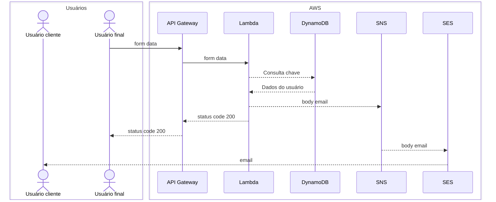

# Boana

## Etimologia

> "Boana" é um gênero de rãs (pererecas) da família Hylidae, conhecidas como rãs-gladiadoras ou pererecas neotropicais,

## Objetivo

Desenvolver uma api de disparo de emails semelhante ao [staticforms](https://www.staticforms.xyz) aonde o formulário aponta para a nossa api

```html
<form action="https://api.boana/submit/${key}" method="POST">
  <input name="email" />
  <input name="name" />
</form>
```

## Resumo

Quando se está desenvolvendo formulários web é necessário a criação de um banco para a persistênca de um banco e consequentemente a uma aplicação rodando do lado do servidor.
Isso prolonga o tempo de desenvolvimento colocando novas etapas e para isso iremos resolver o problema com a nossa aplicação

## Como funcionará?

- O usuário criará uma conta dentro do nosso sistema e isso lhe dará uma chave de autenticação
- O usuário colocará a URL com a chave no seu formulário
- Quando alguém preencher este formulário os dados será enviado para a nossa api
- A api irá disparar um email para o endereço criado pelo usuário

## fluxograma



## Tecnologias:

É proposto as seguintes tecnologias:

- [ReactJS](https://react.dev): O React permite que você crie interfaces de usuário a partir de peças individuais chamadas de componentes.
- [vite](https://vite.dev/): Vite é uma ferramenta de construção do front-end extremamente rápida que alimenta a próxima geração de aplicações da Web.
- [NestJS](https://nestjs.com/): Um framework Node.js progressivo para construir aplicações de servidor eficientes, confiáveis ​​e escaláveis.
- [PNPM](https://pnpm.io/pt/): Gestor de pacotes rápidos e eficientes do espaço em disco.

## Ferramentas

- [API Gateway](https://docs.aws.amazon.com/pt_br/apigateway/latest/developerguide/welcome.html): O Amazon API Gateway é um serviço da AWS para criação, publicação, manutenção, monitoramento e proteção de APIs REST e WebSocket em qualquer escala.

- [AWS Lambda](https://docs.aws.amazon.com/pt_br/controltower/latest/userguide/lambda.html): Com AWS Lambda, você pode executar código sem provisionar ou gerenciar servidores. Você pode executar o código em vários tipos de aplicações ou serviços de backend, sem a necessidade de sobrecarga de administração adicional.

- [Simple Notification Service](https://docs.aws.amazon.com/pt_br/lambda/latest/dg/with-sns.html): O Amazon SNS oferece suporte às funções do Lambda como destino para mensagens enviadas para um tópico

- [Simple Email Service](https://docs.aws.amazon.com/pt_br/ses/latest/dg/Welcome.html): É uma plataforma de e-mail que oferece uma forma fácil e econômica para você enviar e receber e-mail usando seus próprios endereços de e-mail e domínios.

- [DynamoDB](https://aws.amazon.com/pt/dynamodb/?trk=0369cb10-8011-42bb-b5a0-6a0be6456709&sc_channel=ps&ef_id=CjwKCAiA3fnJBhAgEiwAyqmY5UdG5C91j6oRxEnFV1jksch0RHJxN89mWABJSXQak-tmDOnp4--v0hoCNqAQAvD_BwE:G:s&s_kwcid=AL!4422!3!780600732450!e!!g!!amazon%20dynamodb!23178731213!188219673100&gad_campaignid=23178731213&gbraid=0AAAAADjHtp-z3Ginb1-G2wKKRyYp-J6Be): O DynamoDB oferece gerenciamento zero de infraestrutura, manutenção sem tempo de inatividade, escalabilidade instantânea para qualquer demanda da aplicação e fatura conforme as solicitações.

### Extra

- [Cognito](https://docs.aws.amazon.com/cognito/): O Amazon Cognito gerencia a autenticação e autorização de usuários para seus aplicativos web e móveis.

## Telas

- Landing Page
- Auth
- - Login
- - Cadastro
- - Troca de senha
- - 2FA
- Dashboard
- - limites
- - Gerenciamento de chaves e webhooks
- - Logs de envio
- - Sandbox

## Criação de branch

Use o atalho disponível na atividade no canto direito.
